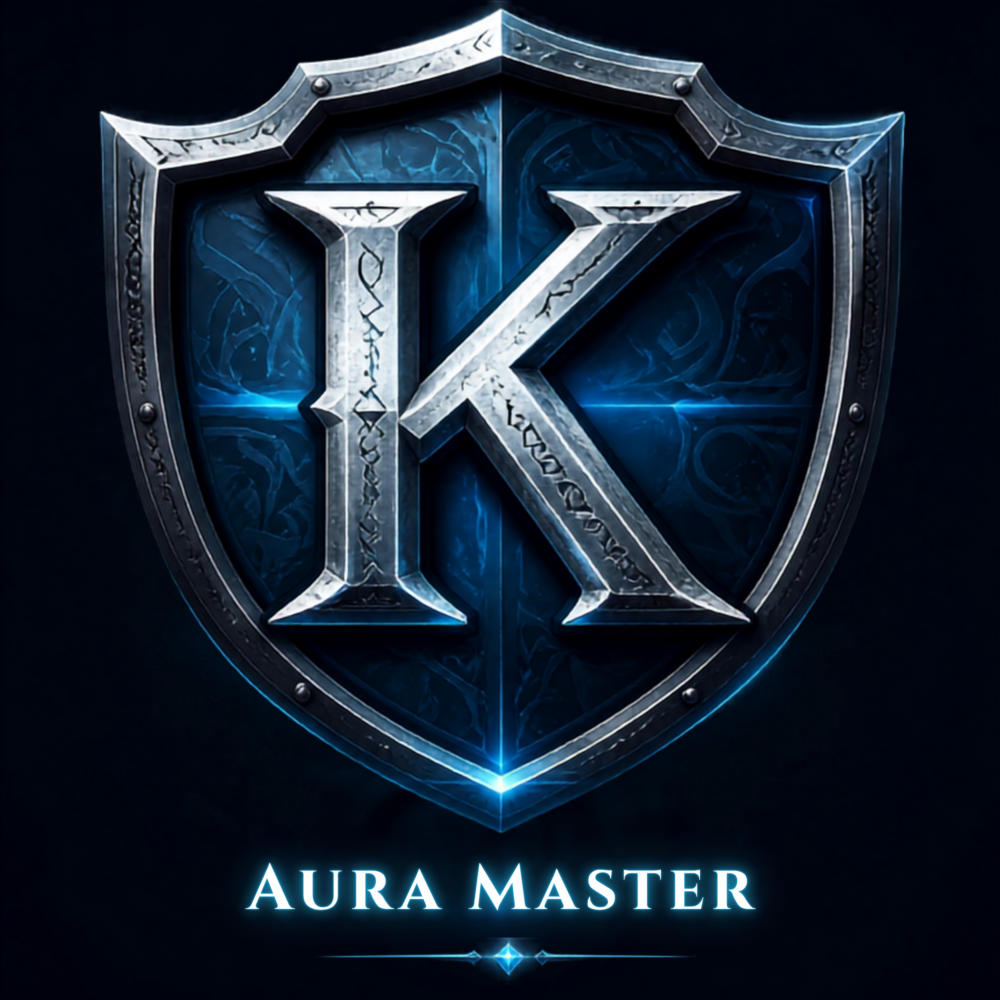

# Ka0s Aura Master

Ka0s Aura Master lets you build your own buff and debuff displays. Each one is a container. You pick
whose auras it shows (yours, your target's, your focus's or your pet's), whether it shows buffs,
debuffs or your weapon enchants, and whether they draw as timer bars or as icons. Make as many as you
like and trim each one down to the auras you actually care about. They can sit anywhere on screen or
hang off another frame.

It is built around the aura rules Midnight brought in. Since patch 12.1 the game hides aura details
from addons during combat, so Aura Master never reads your auras at all. It tells the game's own aura
display what to show and how to dress it, and the game handles the rest, in combat and out of it.

Everything is set up from the addon's page under Settings → AddOns, or from chat with `/am`.

## Usage

Your first login gives you three containers to start from: your buffs as bars near the top right of
the screen, your debuffs as a row of icons just above them, and the debuffs you've put on your target
as icons a little below the middle of the screen. They start locked. Type `/am unlock` and each one
fills with sample auras. It also gets a gold-edged handle with its name, placed just outside the
first bar or icon so it never covers one. Drag the handles where you want them and type
`/am lock`. Right-clicking a handle opens the settings with that container already selected.

Those sample auras are the preview, and `/am preview` shows them without unlocking anything. It's the
quickest way to try textures, fonts and sizes before a real buff turns up. Real auras stay hidden
while the preview is on, and locking or a `/reload` turns it off.

Five of the settings pages edit one container at a time, and a Container dropdown at the top of each
picks which one. The choice follows you from page to page. Containers is where you create, rename,
duplicate and delete them, change a container's unit, aura type or style, or copy another container's
settings onto it. Filters decides what gets shown: who cast it, timed or permanent auras, a maximum
duration, categories like defensives, crowd control or boss debuffs (each one set to Show, Hide or
left alone), your own spell lists, and an always-show and a never-show list. When a filter can't work
where you've put it, an orange line at the top of the page tells you why. Bars and Icons hold the
look for each style.

Layout decides where a container lives. It can sit on the screen, follow another container as that
one grows, or attach to any named frame, like your unit frame or an action bar; **Pick a frame…**
closes the settings so you can just click the frame you want. The same page covers growth direction,
spacing, scale and tooltips, and right-clicking one of your own buffs cancels it unless you switch
that off. General → Display can hide Blizzard's own buff and debuff frames. Most of this works from
chat too: `/am new target debuffs icons` makes a container, `/am select` changes which one you're
editing, and `/am set` changes any single setting. `/am disable` hides every container at once,
`/am enable` brings them back, and neither one waits for combat to end. If you change something else
mid-fight, it waits until combat ends (or, inside a key, encounter or match, until that's over), and
chat tells you which.

Everything else is on the addon's page under Settings → AddOns, and `/am help` (or `/auramaster help`)
lists every command.

## How the containers work

Aura Master never looks at an aura itself. It sounds roundabout, but on 12.1 it's the only way an
addon can still show your auras in the middle of a boss fight. The steps go like this:

1. You describe a container: whose auras, which kind, what to filter out and how it should look.
2. Aura Master turns your filters into rules the game understands (one set for each category you set
   to Show, or a single set when none is) and hands them to the aura display the game added in 12.1.
3. The game watches that unit's auras, in combat too, where addons aren't allowed to look, and keeps
   the ones that match.
4. For each match the game makes a bar or an icon, and Aura Master dresses it with your textures,
   fonts, colors and border. The game fills in the icon, the name, the time left and the stack count,
   and runs the countdown.
5. When you change a setting, Aura Master rebuilds the rules and redresses what's already on screen as
   soon as the game allows it.

Two limits come out of this. The game has no rule for "auras without a duration", so for that filter
Aura Master learns which of your and your pet's buffs carry a timer while you're out of combat, and
leaves those out. A new timed buff can slip through once before it's learned. The game also only
accepts spell-by-spell lists for buffs on friendly units and debuffs on hostile ones, so a spell list
on your own debuffs does nothing, and the Filters page warns you when that's the case.

## FAQ

| Question | Answer |
|----------|--------|
| Do I need to install anything else? | No. Everything the addon needs comes inside it. |
| Why doesn't my change show up in the middle of a fight? | The game locks its aura display whenever aura details are hidden from addons: in combat, during boss encounters, in Mythic+ keys and in PvP matches. Aura Master holds the change, mentions it once in chat, and applies it as soon as the lock lifts. |
| Can I track my party or raid? | Not yet. Player, target, focus and pet work today. Party members are planned and tracked as a GitHub issue, and so is a text-only container style. |
| Can I put a container on my unit frame? | Yes. On Layout → Position set **Attach to** to *A named frame*, then use **Pick a frame…** and click it. If the frame belongs to an addon that hasn't loaded yet, the container waits at its screen position and moves over once the frame exists. |
| Why does my spell list do nothing on my debuffs? | Blizzard only allows spell-by-spell filtering for buffs on friendly units and debuffs on hostile ones. Categories, dispel types and the other filters work on any unit. |
| A timed buff showed up in my "without a duration" container. Why? | That filter learns which buffs have a timer while you're out of combat. A buff you've never seen out of combat can slip through the first time; after that it's known. `/am forgettimed` clears everything it learned. |
| How do I cancel a buff? | Right-click it in a container that shows your own buffs or weapon enchants. Untick **Right-click to cancel** on Layout → Mouse if you'd rather it didn't. |
| Can I hide Blizzard's buff frame? | Yes, on General → Display. Your weapon enchants live in that same Blizzard frame and go with it, so add them to a container with **Also show weapon enchants** on the Filters page. |
| Can different characters have different setups? | Yes, through the Profiles page. A profile holds every container, so switching profiles swaps the whole set. |
| Why won't the settings open in combat? | The game protects its settings window during combat, so `/am config` prints a gray line instead of opening it. Try again once combat ends. |

## Troubleshooting

| Symptom | Fix |
|---------|-----|
| Nothing shows at all | On General → Master controls, check that **Enable Aura Master** is ticked (`/am enable` ticks it) and that **General visibility** isn't set to *Never*, or to a combat state you're not in. Then check the container's own **Enabled** box on the Containers page. |
| I only see the sample auras | You're unlocked or in preview. Type `/am lock`, or `/am preview off`. |
| A container stays empty and the Filters page says "These filters can never match anything." | Two of your choices rule each other out, such as a spell category with every spell unticked. Loosen one of them, for example by setting a category back to its neutral dash. |
| An orange line says my spell lists only apply to friendly or hostile units | That's the game's rule, not a fault. The spell lists on that container will only work while the unit is the kind the line names. |
| I can't drag a container | Only containers attached to the screen can be dragged, and not during combat. An attached container follows its target; move it with the offsets on Layout → Position, or use **Attach to the screen**. |
| A container attached to a frame is sitting somewhere else | The frame wasn't found, so the container fell back to its screen position. Check the name in **Frame name** (`/fstack` shows frame names), or pick the frame again. |
| Blizzard's buff frame is still showing after I hid it | Blizzard's frames can't be moved during combat. The change goes through as soon as combat ends. |
| My weapon enchants don't show | Enchants appear in a container showing your own buffs with **Also show weapon enchants** ticked, or in one whose aura type is *Weapon enchants*. Enchants that never expire are skipped while **Hide enchants without a duration** is on. |
| Chat says the client has no aura container API | Aura Master needs Retail patch 12.1 or later. |

## Issues and feature requests

Bugs, ideas and planned work all live in the GitHub issue tracker:
[https://github.com/tusharsaxena/AuraMaster/issues](https://github.com/tusharsaxena/AuraMaster/issues).
Please file reports there rather than in comments, so nothing gets lost.

## Version History

| Version | Date | Highlights |
|---------|------|------------|
| 0.1.0 | 2026-09-11 | First release: buff, debuff and weapon enchant containers for player, target, focus and pet, drawn as bars or icons, with category filters, spell lists, attach-anywhere placement and a preview mode |

## Credits

The trick that lets a permanent buff draw as a full bar, and the idea of learning which buffs carry a
timer so the rest can be shown on their own, both come from TinyBuffBars by mixMugz, released under
the MIT license.
